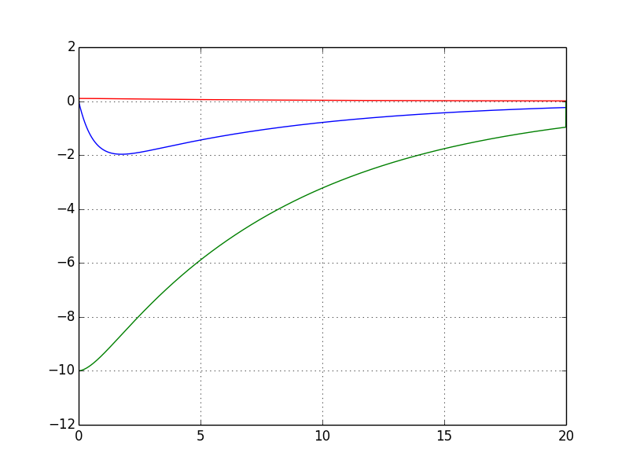
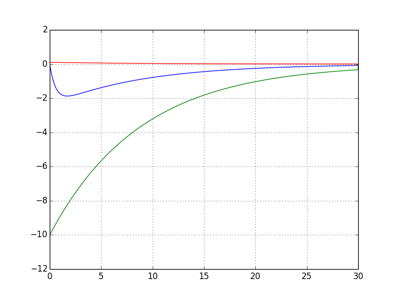

# DC-motor simulations

## Equations of motion

### Electrical equation

where 
- U - input voltage
- L - rotor inductance
- R - rotor coils resistance
- kw - back EMF term proportional to w

### Mechanical equation

where
- J - momentum of inertia of the rotor
- B - friction due to rotation
- TM - torque of the motor
- TL - torque of the load
- m - mass of the load
- r - radius of the shaft

Note that the friction due to the movement of the mass is neglected.

### Assumptions

thus the DC-motor can be described with one equation

## The system to control

In this example I want to position a cart pulled by the motor at certain location, so that the system transitions from the state [x1, w1 (typically w1 = 0)] to [0, 0]

### Equations of the system

where

 and 

### Controllability

Controllability matrix 

, rank equals 2 thus the system is controllable

## Step response

## PID controller

## LQR controller

## TODO

- find alpha, beta parameters for the real motor based in step response
- take into account load friction and stall torque
